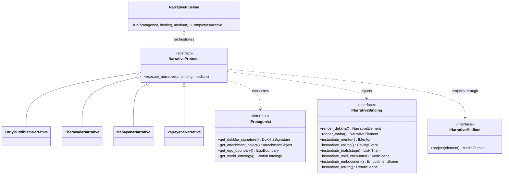
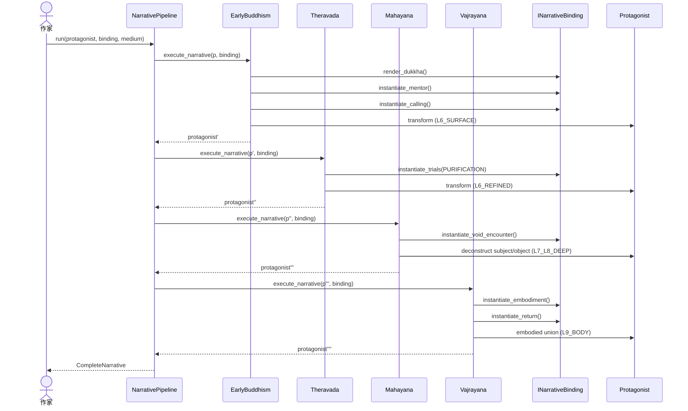
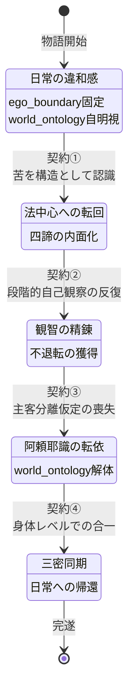
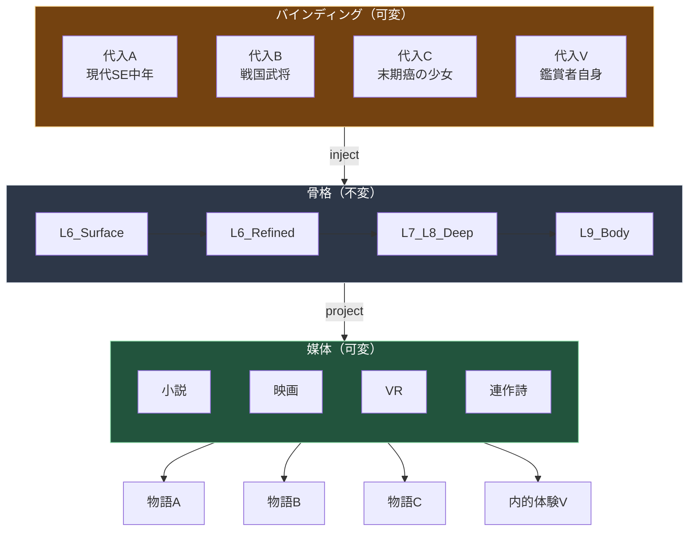
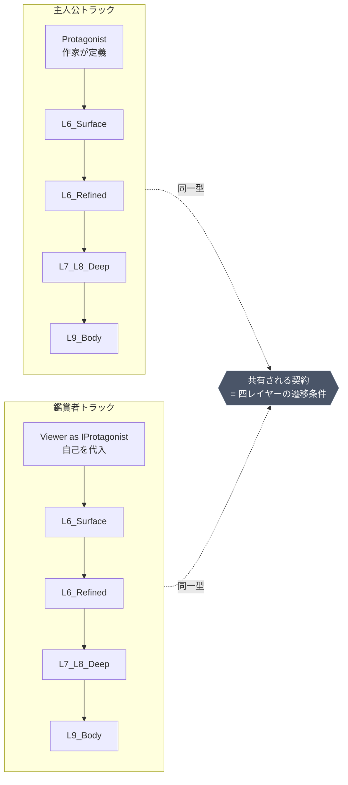

# 仏教変容プロトコル ナラティブ注入仕様書

**バージョン:** 1.0
**依存:** `buddhism-protocol-spec.md` v1.0, `buddhism-term-list.md`
**目的:** 既存の変容パイプラインを抽象化し、任意のナラティブ（作家の世界観・鑑賞者の実存）を代入可能な**戦略パターン**として再定義する。

-----

## 0. 位置付け

```
buddhism-structured-protocol.md     → 構造マップ（WHAT）
buddhism-term-list.md               → 語彙辞書（VOCABULARY）
buddhism-protocol-spec.md           → 実装仕様（HOW, concrete）
buddhism-heros-journey.md           → 物語の一例（instance of narrative）
本書                                 → ナラティブ抽象層（HOW, polymorphic）
```

既存`protocol-spec`の`Individual`は「凡夫から仏へ」という単一の具象に固定されている。本書はこれを**型変数 `P extends Protagonist`** に昇格させ、四段階パイプラインを任意のナラティブで再利用可能にする。

-----

## 1. 設計原則

1. **骨格の不変性**: 四段階（L6表層 → L6精錬 → L7-L8深層 → L9+身体）の順序と変換契約は固定
1. **表層の自由度**: 各ステージの具体的描写・舞台・登場人物・象徴は差し替え可能
1. **契約ベース注入**: 各スロットは型ではなく**機能契約**（何を達成せねばならないか）で拘束される
1. **鑑賞者の重ね合わせ**: `Protagonist` と `Viewer` は別インスタンスだが、同一の `INarrativeBinding` を共有できる

-----

## 2. 抽象型定義

### 2.1 `Protagonist` インターフェース

既存`Individual`を抽象化。必須スロットのみを規定し、具体属性は作家が自由に拡張する。

```
interface IProtagonist {
    // --- 必須スロット（契約）---
    get_dukkha_signature() -> DukkhaSignature
        // 「何が噛み合わないか」の具体表現を返す
        // 例: 失恋 / 事業失敗 / 難病 / 創造の枯渇 / AI時代の虚無

    get_attachment_object() -> AttachmentObject
        // 執着の宿る具体的対象
        // 例: 亡き家族 / 完璧主義 / 肩書 / 過去の栄光 / 恋人

    get_ego_boundary() -> EgoBoundary
        // 現在のエゴ境界の範囲と強度
        // 何を「自分」と同定しているか

    get_world_ontology() -> WorldOntology
        // 主人公が前提としている世界観（これが解体される対象）
        // 例: 因果律 / 運命論 / 物質主義 / ロマン主義 / 勝者の倫理
}
```

作家は`IProtagonist`を実装するだけで、武士・SEの中年・少女・AI・動物・組織体・国家ですら主人公に据えられる。

### 2.2 `INarrativeBinding` インターフェース

各仏教概念と作家独自の物語要素を結合するマッピング。これがナラティブ注入の中核。

```
interface INarrativeBinding {
    // --- 四諦の具現化スロット ---
    render_dukkha() -> NarrativeElement
        // 苦の感覚を何として描くか（風景・関係性・身体症状・隠喩）

    render_tanha() -> NarrativeElement
        // 渇愛を何として描くか（強迫行動・幻影・中毒・繰り返される台詞）

    render_nirodha_hint() -> NarrativeElement
        // 滅の予感を何として描くか（沈黙・光・余白・死の暗示）

    // --- メンター・召命スロット ---
    instantiate_mentor() -> IMentor
        // 賢者役を何として登場させるか
        // 例: 老師 / 死期の祖母 / 機能を失った機械 / 自然現象 / 書物

    instantiate_calling() -> CallingEvent
        // 召命の具体的イベント

    // --- 試練スロット ---
    instantiate_trials(stage: Stage) -> List[Trial]
        // 上座部フェーズの段階的試練を何として描くか

    // --- 解体スロット ---
    instantiate_void_encounter() -> VoidScene
        // 空との遭遇シーン（最難関）
        // 主客が同時に崩壊する場面を何として表現するか

    // --- 合一スロット ---
    instantiate_embodiment() -> EmbodimentScene
        // 身体的合一を何として描くか
        // 作家の文化圏・媒体に応じて自由

    // --- 帰還スロット ---
    instantiate_return() -> ReturnScene
        // 日常への戻り方と、変容した主人公の描写
}
```

### 2.3 `INarrativeMedium` インターフェース

媒体ごとの表現層を分離する。同じ`INarrativeBinding`を小説にもVRにも投射できる。

```
interface INarrativeMedium {
    project(element: NarrativeElement) -> MediaOutput
    // 小説 / 映画 / 演劇 / ゲーム / 連作詩 / 楽曲 / 絵画連作 等
}
```

-----

## 3. 抽象プロトコル基底クラス

既存`IProtocol`を総称化する。

```
abstract class NarrativeProtocol<P extends IProtagonist> {

    abstract execute_narrative(
        protagonist: P,
        binding: INarrativeBinding,
        medium: INarrativeMedium
    ) -> NarrativeTransformation<P>

    // 契約: 入力の Protagonist は出力で必ず以下を満たす
    //   - 当該レイヤーの認識OSが変容している
    //   - 前段レイヤーの獲得は破壊されていない
    //   - binding により注入された具体要素が物語として consistent である
}
```

各仏教プロトコルはこれを継承し、骨格的な変換ロジックのみを保持する。作家は**プロトコルを書き換えず、Bindingのみを書く**。

-----

## 4. 四プロトコルの抽象化

### 4.1 `EarlyBuddhismNarrative`

```
class EarlyBuddhismNarrative extends NarrativeProtocol<IProtagonist> {
    execute_narrative(p, binding, medium):
        scene1 = binding.render_dukkha()           // 苦の提示
        scene2 = binding.render_tanha()            // 渇愛の露見
        mentor = binding.instantiate_mentor()       // 賢者の登場
        calling = binding.instantiate_calling()     // 召命
        // → 主人公は「自己中心から法中心への転回」という
        //    認知レベルの第一変容を受ける
        return NarrativeTransformation(p, layer=L6_SURFACE)
}
```

**作家の自由度**: 苦の内容、賢者の姿、召命の劇的強度は完全に自由。契約は「主人公が自分の苦を構造として認識する瞬間が物語内に存在すること」のみ。

### 4.2 `TheravadaNarrative`

```
class TheravadaNarrative extends NarrativeProtocol<IProtagonist> {
    execute_narrative(p, binding, medium):
        trials = binding.instantiate_trials(stage=PURIFICATION)
        for trial in trials:
            p = trial.transform(p)
        // 契約: 主人公は段階的な自己観察の反復を経験する
        //       ただし各試練の具体は完全に作家の領分
        return NarrativeTransformation(p, layer=L6_REFINED)
}
```

**作家の自由度**: 修行は物理的な修行でなくてよい。家事、看護、経営、研究、育児、戦闘、すべてが「七清浄」の外殻に代入可能。

### 4.3 `MahayanaNarrative`

```
class MahayanaNarrative extends NarrativeProtocol<IProtagonist> {
    execute_narrative(p, binding, medium):
        void_scene = binding.instantiate_void_encounter()
        // 契約（最重要）:
        //   この場面の後、主人公の world_ontology は
        //   「主客が独立して存在する」仮定を失っていなければならない
        p = void_scene.deconstruct(p)
        return NarrativeTransformation(p, layer=L7_L8_DEEP)
}
```

**作家の自由度**: 解体の演出は幻想・夢・認知崩壊・病・臨死・愛・暴力・数学的直観のいずれでもよい。契約は「主客分離の喪失」という機能のみ。

### 4.4 `VajrayanaNarrative`

```
class VajrayanaNarrative extends NarrativeProtocol<IProtagonist> {
    execute_narrative(p, binding, medium):
        embodiment = binding.instantiate_embodiment()
        return_scene = binding.instantiate_return()
        // 契約:
        //   1. 合一は身体レベルで起きねばならない（概念的理解では不足）
        //   2. 主人公は日常へ戻らねばならない（閉じた悟りは不可）
        return NarrativeTransformation(p, layer=L9_BODY)
}
```

**作家の自由度**: 「身体」は生物学的身体に限定されない。組織体の身体、AIのハードウェア、楽器奏者の手、書家の筆、すべてが身体スロットに注入可能。

-----

## 5. オーケストレータ

```
class NarrativePipeline<P extends IProtagonist> {

    run(
        protagonist: P,
        binding: INarrativeBinding,
        medium: INarrativeMedium
    ) -> CompleteNarrative<P>:

        protocols = [
            EarlyBuddhismNarrative(),
            TheravadaNarrative(),
            MahayanaNarrative(),
            VajrayanaNarrative()
        ]

        current = protagonist
        chapters = []
        for protocol in protocols:
            transformation = protocol.execute_narrative(current, binding, medium)
            chapters.append(transformation.to_chapter())
            current = transformation.protagonist

        return CompleteNarrative(chapters=chapters, final=current)
}
```

-----

## 6. 代入例（instance 化のデモ）

同一パイプラインに異なる`INarrativeBinding`を代入した例。

|スロット                        |代入A: 現代SE中年男性 |代入B: 戦国武将  |代入C: 末期癌の少女|
|----------------------------|--------------|-----------|-----------|
|`render_dukkha`             |深夜の虚無感、昇進の空虚  |敗戦の屈辱、一族の喪失|身体の衰え、未来の剥奪|
|`instantiate_mentor`        |退職した先輩のメール    |旅の僧侶       |病室で出会う老患者  |
|`instantiate_trials`        |コードレビュー / 転職活動|放浪 / 禅寺での修行|治療のサイクル    |
|`instantiate_void_encounter`|バグの夢の中で自他崩壊   |戦場で死を見つめる瞬間|麻酔中の意識解体   |
|`instantiate_embodiment`    |タイピングのリズムとの同期 |刀と身体の一致    |呼吸と朝日の一致   |
|`instantiate_return`        |家族との平凡な夕食     |農民としての余生   |最期の言葉      |

**骨格は同一**: L6表層 → L6精錬 → L7-L8深層 → L9+身体 の遷移と契約は不変。  
**表層は別物**: 読者/鑑賞者が全く違う物語として体験する。

-----

## 7. 鑑賞者の代入

`Viewer` も`IProtagonist`を実装できる。鑑賞者は自分自身の `DukkhaSignature` をバインディングに注入することで、物語の骨格に自己を重ね合わせる。

```
class ViewerAsProtagonist implements IProtagonist {
    // 鑑賞者自身の実存的スロット
}

// 物語の主人公と鑑賞者は、同一の NarrativePipeline を別インスタンスで走らせる
// 両者の chapter は独立だが、layer 遷移の契約は共有される
```

これにより、「物語の主人公の旅」と「鑑賞者自身の内的旅」は、**同じ型シグネチャを持つ並行プロセス**となる。作家が設計するのは物語の骨格のみ。鑑賞者がどう代入するかは鑑賞者の自由である。

-----

## 8. 契約の厳密性と表層の無拘束性

本プロトコルの核は以下の非対称性にある。

|層             |拘束                         |
|--------------|---------------------------|
|骨格（四レイヤー遷移と契約）|**厳密**: 違反したら物語は機能しない      |
|バインディング（具体要素） |**自由**: 作家・鑑賞者・文化圏・媒体ごとに任意 |
|媒体（表現フォーマット）  |**自由**: 同一バインディングを複数媒体に投射可能|

この非対称性が、仏教のプロトコルを「時代と文化を超えて再実装され続けている」理由そのものと対応する。骨格は2500年変わらず、表層だけが各時代に合わせて書き換えられてきた。本仕様は、その歴史的事実をオブジェクト指向の語彙で明示したものにすぎない。

-----

## 9. 既存仕様との関係と拡張ポイント

- `buddhism-protocol-spec.md` の具象実装は、本仕様の**一つのインスタンス**（鑑賞者=修行者本人、バインディング=伝統的仏教語彙、媒体=実生活）として再解釈できる
- 新しい宗派・思想・心理療法も、`INarrativeBinding` の新しい実装として追加可能（プロトコル本体は無変更）
- KPI（`tanha_intensity` 等）は抽象レイヤーでは**契約の充足判定関数**として再定義され、具体値の計測は各バインディングが担当する

-----

## 10. 結論

ナラティブプロトコルは、仏教四段階の骨格を**型パラメータ化された戦略パターン**として提示する。作家は骨格を書かず、スロットを埋める。鑑賞者は骨格を読まず、自分を代入する。プロトコルは両者に対して中立で、両者のナラティブが同じパイプライン上を並行して流れることを保証するだけである。

これが、既存4ドキュメントが暗黙に要求していた抽象化層である。

-----

**以上をナラティブ注入仕様とする。**

# ナラティブプロトコル プロセス図

4つの視点から図示する。すべてmermaid。

-----

## 1. 型アーキテクチャ（クラス図）

骨格（固定）と注入点（可変）の非対称性を示す。



-----

## 2. 実行パイプライン（シーケンス図）

1ランの流れ。各プロトコルがBindingから具体要素を取り出し、Protagonistを変容させ、次段へ渡す。



-----

## 3. レイヤー遷移と契約（状態遷移図）

各ステージの遷移条件＝契約を明示する。契約違反は物語不成立。



-----

## 4. 代入による多様化（フローチャート）

同一パイプラインに異なるBindingを代入すると別の物語が出力される様子。



-----

## 5. 主人公と鑑賞者の並行実行

両者は別インスタンスだが同一パイプライン上を走る。



-----

## 図の読み方まとめ

|図         |示すもの   |核心               |
|----------|-------|-----------------|
|1. クラス図   |型の構造   |骨格と注入点の分離        |
|2. シーケンス図 |1ランの時系列|Bindingが各段で呼び出される|
|3. 状態遷移図  |レイヤー契約 |違反したら物語不成立       |
|4. フローチャート|代入の多様化 |同骨格から無数の物語       |
|5. 並行トラック |主人公と鑑賞者|同型シグネチャの並行プロセス   |